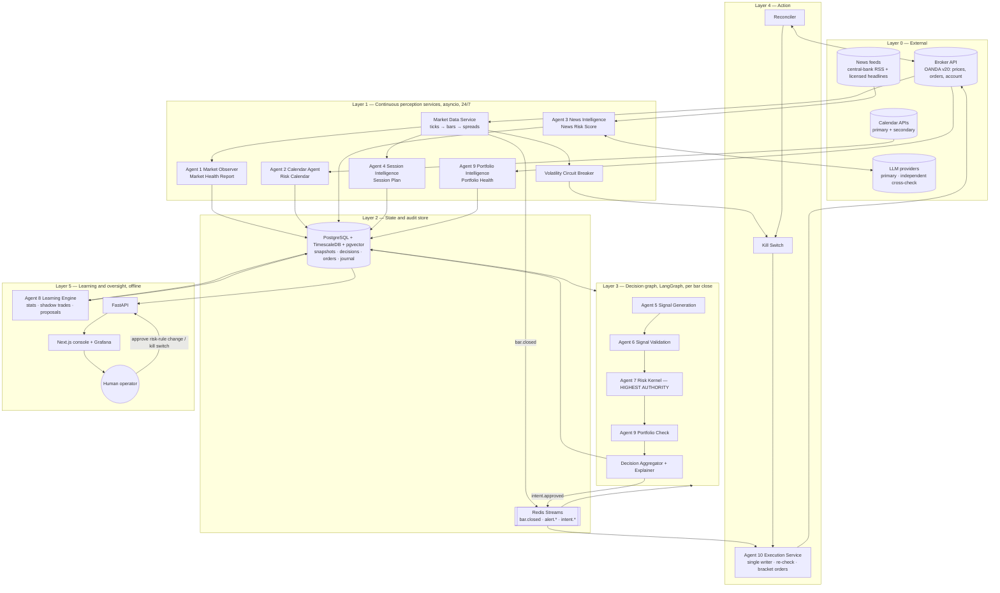

# 01 — Complete Architecture

## 1. Layered view

The system has five layers. Data only flows **upward** through typed contracts. Authority flows **downward**: the risk kernel can veto anything above it.



### Why this shape
- **Perception is separated from decision.** Perception services run continuously and write snapshots. The decision graph is a short, bounded, replayable function of those snapshots. A decision can therefore be **replayed exactly** from the stored snapshot IDs, which is what makes every decision explainable after the fact.
- **The decision is separated from the action.** The graph produces an *intent*. Only the execution service talks to the broker, and it re-validates first.
- **Learning is offline and read-only** with respect to live configuration. It writes *proposals*. Humans write rules.

## 2. Operating modes

One code path runs in five modes. The mode is a value in the `system_state` row. Mode transitions are gated by the evaluation criteria in [docs/06 §2.5](06-monitoring-and-evaluation.md).

| Mode | Market data | Decisions | Orders | Purpose |
|---|---|---|---|---|
| `BACKTEST` | historical replay | yes | simulated fills (cost model) | strategy research |
| `SHADOW` | live | yes | none (intents logged) | validate the live pipeline without a broker |
| `PAPER` | live | yes | broker **practice** account | validate execution and reconciliation |
| `LIVE_MICRO` | live | yes | live, risk capped at 0.1%/trade | validate real fills and slippage |
| `LIVE` | live | yes | live, ruleset risk | production |

Orthogonal **trading states**: `ACTIVE`, `NO_NEW_TRADES` (manage existing positions only), `FLATTEN` (close everything, then `HALTED`), `HALTED` (needs a human to reset; the state a fresh system starts in).

## 3. Agent specifications

Every agent has: **inputs**, **output contract** (a Pydantic model persisted to a table), **cadence**, **staleness budget** (if exceeded, consumers treat the output as missing, which means BLOCK), and **failure mode**.

### Agent 1 — Market Observer → `MarketHealthReport`
- **Inputs:** streaming prices (bid/ask) for EURUSD, GBPUSD, USDJPY, AUDUSD, USDCAD; M1 bars built locally and cross-checked against broker M1/H1 candles.
- **Computes, per pair:**
  - OHLC for M5/H1/H4/D1 (from the broker's mid candles; bid/ask kept separately for the cost model)
  - ATR(14) on H1/H4/D1, and ATR percentile vs a 1-year window → **volatility regime** {low, normal, elevated, extreme}
  - Realised volatility (Parkinson / Garman–Klass on H1)
  - Trend: EMA(20/50/200) alignment and slope, ADX(14), H4 market-structure state (HH/HL, LH/LL, range) from confirmed fractal swings
  - Support/resistance: clustered confirmed swing highs/lows (lookback 120 H4 bars), prior day/week high/low, round numbers. Each level carries a touch count and an age.
  - Liquidity proxy: current spread / session-median spread, ticks per minute vs norm
  - Data quality: last tick age, missing bars, bid > ask anomalies
- **Output:** `MarketHealthReport{pair, as_of, regime, trend_state, structure, levels[], atr{}, spread_ratio, liquidity_score, data_quality, healthy: bool, reasons[]}`
- **Cadence:** on every M5 close and on demand. **Staleness budget:** 6 min.
- **Failure:** a feed gap > 30s in an active session sets `data_quality=DEGRADED` and `healthy=false`.

### Agent 2 — Economic Calendar → `RiskCalendar`
- **Inputs:** primary + secondary calendar APIs; a static file of known tier-1 schedules (FOMC/ECB/BoE/BoJ/RBA/BoC meeting dates, NFP).
- **Classification:**
  - **Tier 1** (blackout ±60 min, FOMC/ECB from −120 min to +30 min after the press conference ends): FOMC, ECB, BoE, BoJ, RBA and BoC rate decisions; US NFP; US CPI; Fed Chair testimony.
  - **Tier 2** (±30 min): GDP, PMI flash, retail sales, unemployment (non-US), core PCE, other CPI.
  - **Tier 3:** logged only.
- **Maps** each event to affected **currencies**, then to pairs (USD events affect all 5 pairs).
- **Output:** `RiskCalendar{as_of, events[], blackout_windows[{currency, start, end, tier, reason}], source_agreement: bool, feed_fresh: bool}`
- **Failure:** feed stale > 6h, or the two sources disagree on a tier-1 time by > 5 min → `HALTED` until a human has reviewed it. *This is deliberately conservative: a missing calendar means flying blind.*

### Agent 3 — News Intelligence → `NewsRiskAssessment`
Two layers. The **deterministic layer always runs first and alone can block.**
1. **Tripwires** (regex/keyword, per currency): `intervention`, `emergency (meeting|cut|hike)`, `unscheduled`, `peg`, `capital controls`, `default`, `sanctions`, `invasion`, `bank (run|failure)`, `circuit breaker`, `flash crash`, plus central-bank names combined with surprise verbs. A hit on a credible source blocks new risk in the affected currency until a human clears it (no automatic expiry).
2. **LLM classifier** (PydanticAI, primary provider). The headline/body is wrapped as **untrusted data** and the output is forced into this schema:
   ```python
   class NewsClassification(BaseModel):
       category: Literal["monetary_policy","macro_data","geopolitical","fiscal",
                         "market_structure","corporate","other"]
       currencies: list[Literal["USD","EUR","GBP","JPY","AUD","CAD","CHF","CNY"]]
       severity: Literal[0,1,2,3]          # 3 = black-swan candidate
       surprise: bool                      # vs. consensus / scheduled
       directional_bias: dict[str, Literal["hawkish","dovish","risk_off","risk_on","neutral"]]
       confidence: float = Field(ge=0, le=1)
       rationale: str = Field(max_length=400)
   ```
   - **Cross-check:** severity ≥ 2 is re-classified by the secondary provider. The **maximum** severity of the two is kept.
   - **Monotonicity:** the per-currency `news_risk_score ∈ [0,100]` = max(tripwire score, LLM score with decay). The LLM can raise it and can never lower it below the tripwire baseline. `directional_bias` is **logged for learning only and is never used to generate or approve a signal** until a future eval proves it has value.
   - **Novelty:** pgvector cosine similarity > 0.92 to a headline in the last 6h means a duplicate, and it does not re-raise the score.
- **Output:** `NewsRiskAssessment{as_of, per_currency{score, top_items[], blocks[]}, feed_fresh}`
- **Failure:** LLM timeout or error → deterministic layer only, plus `+15` score penalty. News feed silent > 15 min in an active session → `feed_fresh=false` and the validation gate fails.

### Agent 4 — Session Intelligence → `SessionPlan`
- Sessions are computed in **exchange-local time** with tz database rules:
  - Tokyo 09:00–18:00 JST
  - London 08:00–17:00 Europe/London
  - New York 08:00–17:00 America/New_York
- **Per day and session, computes from trailing 60 trading days per pair:**
  - Expected range (median ATR-normalised range)
  - Median spread
  - Tick rate
  - Historical setup expectancy (from the learning store, shrunk)
- Today's adjustments: tier-1 events inside the session, holidays (e.g. Tokyo closed → JPY liquidity thin), Friday/month-end (fixing at 16:00 London), proximity to rollover.
- **Output:** `SessionPlan{date, per_session{expected_vol, liquidity, risk_flags[], tradeable: bool}, best_session, avoid_sessions[], reasons[]}`
- Prepared **daily at 21:30 UTC** for the next day (the "prepare for upcoming sessions" requirement) and refreshed hourly.
- **Rule of thumb, encoded and tested:** London–NY overlap (≈12:00–16:00 UTC) is the default preferred window. Tokyo is tradeable only for JPY and AUD pairs. The last hour before rollover is always avoided.

### Agent 5 — Signal Generation → `SignalCandidate[]`
Deterministic detectors on **H1 close**, with H4/D1 context. Each detector is a pure function `(bars, MarketHealthReport) -> list[SignalCandidate]`, versioned (`detector_id@semver`). Starting set (parameters are research inputs, fixed before out-of-sample testing):

| Detector | Long condition (mirror for short) | Stop | Target |
|---|---|---|---|
| `trend_pullback` | H4 EMA50 > EMA200, both rising, ADX(H4) > 20; H1 price retraces into EMA20–EMA50 zone or the 38–62% retracement of the last H1 impulse; H1 bullish rejection close | below pullback swing low − 0.5×ATR(H1), ≥ 1.0×ATR(H1) | next H4 resistance, or 2R if the nearest level is > 3R |
| `structure_break_retest` | H4 structure flips to HH/HL; H1 closes above the broken swing high; retest holds within 6 bars | below retest low − 0.3×ATR(H1) | measured move / next level |
| `range_breakout` | 20-bar H1 range width < 0.6×ATR(D1) (compression), close beyond range + 0.25×ATR(H1), ATR expanding; **not within 2h of a tier-1 event** | opposite side of range midpoint | 1.5× range height |
| `trend_continuation` | D1 + H4 trend aligned, H1 new 20-bar high after ≥ 8 bars of consolidation | below consolidation low | 2.5R |

Every candidate has `entry_type` (limit/stop/market), `entry`, `stop_loss`, `take_profit`, `rr_gross`, **`rr_net`** (after spread + expected slippage + swap for the expected hold), `expires_at`, and `features{}` (a snapshot used by learning).

### Agent 6 — Signal Validation → `ValidationResult`
**Hard gates.** All must pass, and each produces a `RuleResult`:
1. Trend alignment: candidate direction = H4 trend; D1 not strongly opposed.
2. Volatility regime ∈ {normal, elevated}. Low means the stop sits too close to noise. Extreme is blocked.
3. Liquidity: spread_ratio ≤ 1.5 and tick rate ≥ 50% of norm.
4. News: currency news_risk_score < 40 on both legs; no active tripwire.
5. Calendar: no blackout window overlapping [now, now + min(expected hold, 4h)] for either currency.
6. Session: current session `tradeable` and the pair is allowed in this session.
7. Structure: entry is not within 0.5×ATR of an opposing S/R level with ≥ 3 touches.
8. `rr_net ≥ 1.8`.

**Ranking score (0–100), only computed if all gates pass.** Weighted components: trend strength 25, structure clarity 20, level confluence 15, session fit 15, volatility fit 10, distance from opposing level 15. Threshold ≥ 65.
Weights are **priors**. After ≥ 200 resolved trades, the score is replaced by its calibrated mapping. See docs/05 §5.

### Agent 7 — Risk Kernel → `RiskDecision{APPROVED|BLOCKED, size, rule_results[]}`
The highest authority. A **pure function** with no I/O, no clock reads (`as_of` is passed in), no randomness, and no LLM. Full design in [04-risk-engine.md](04-risk-engine.md). It is run **twice**: inside the graph, and again inside the execution lock.

### Agent 8 — Learning Engine → `LessonReport`, `Proposal[]`
Offline jobs (nightly / weekly / monthly). Code computes statistics and the LLM narrates. It **writes proposals only**. Full design in [05-learning-engine.md](05-learning-engine.md).

### Agent 9 — Portfolio Intelligence → `PortfolioHealth`, `PortfolioCheck`
- **Continuous:**
  - Equity curve (incl. unrealised P&L) every minute
  - Peak equity and drawdown
  - Per-currency net exposure (in risk-% and notional)
  - Margin usage and effective leverage
  - EWMA correlation matrix (λ = 0.97, H1 returns)
  - Parametric 1-day 99% VaR of open book
  - **Risk of ruin** (Monte Carlo, docs/04 §6)
- **Per candidate** (`PortfolioCheck`):
  - Marginal effect of adding the trade on currency exposure, total open risk, VaR and worst-case gap loss
  - Approves only if all limits hold *after* the trade
- **Output:** `PortfolioHealth{status: HEALTHY|CAUTION|CRITICAL, equity, dd_pct, exposures{}, var_99, risk_of_ruin, reasons[]}`. `CRITICAL` → `NO_NEW_TRADES`.

### Agent 10 — Execution Service
Not in the graph. It consumes `execution_intents`. A **single process** holding a Postgres advisory lock (only one writer, ever).

State machine per intent:

```
RECEIVED → VERIFYING → (BLOCKED | SUBMITTING) → SUBMITTED → (FILLED | PARTIAL | REJECTED | EXPIRED) → MANAGED → CLOSED
```

Rules:
1. Verify that all 3 approvals (validation, risk, portfolio) exist, reference the same `state_version`, and are younger than their TTL (default 120s).
2. Re-fetch broker account and positions. **Re-run the risk kernel** on fresh state. Price drift from the signal entry must be ≤ 0.25×ATR(H1), and the spread must be OK right now.
3. Submit a **bracket order** (entry + broker-side SL + TP) with `client_order_id = intent_id` for idempotency. If the broker rejects the attached SL, **cancel the entry**. A position never exists without a stop.
4. On fill, record the actual slippage. If the fill is worse than the allowed slippage, keep the position (the stop still bounds risk) but flag it, and feed the slippage stats.
5. Position management is limited to pre-declared, deterministic rules: move the stop to breakeven at +1R (optional per ruleset), time stop after N bars, and the weekend/event protections from the risk kernel.

### Explainer
Builds the **TRADE ALLOWED / TRADE BLOCKED** report from structured `RuleResult`s with a deterministic template. That template is the canonical explanation. An optional LLM rendering produces readable prose, and a validator rejects any rendering that mentions a number not present in the structured input.

Example canonical output:
```
TRADE BLOCKED — EURUSD LONG trend_pullback@1.2.0  (decision d_8f21…, ruleset rs_v7 sha256:4be1…)
  ✗ R-CAL-01  Tier-1 blackout: USD CPI at 12:30 UTC is inside the hold window (now 11:58)
  ✗ R-ACC-04  Consecutive losses = 3 ≥ 3 → cooldown until 2026-10-05 11:00 UTC
  ✓ R-TRD-02  rr_net 2.10 ≥ 1.80
  ✓ R-PTF-01  USD net risk after trade 0.85% ≤ 1.00%
  … (all 31 rules listed)
Shadow-tracking enabled: outcome will be recorded for gate evaluation.
```

## 4. Technology choices: why each, and the critical caveat

| Technology | Why chosen | Caveat / constraint in this design |
|---|---|---|
| **Python 3.12** | Dominant quant ecosystem (NumPy, pandas, statsmodels, scipy). All LLM SDKs are first-class. | Use `uv` for locked, reproducible environments. Strict typing (`mypy --strict` on `risk/` and `domain/`). |
| **FastAPI** | Async, Pydantic-native. OpenAPI generated from the same models used internally, so the API cannot drift from the domain types. | The API is **read-mostly**. Its only mutating endpoints are the kill switch, mode transitions and rule-change approvals, all with re-authentication. |
| **PostgreSQL 16** | ACID for orders and decisions; one store for relational, time-series and vector data; strong role-based grants, which **enforce rule immutability at the DB level**. | One DB for everything is a single point of failure. Mitigate with WAL archiving, PITR and daily restore tests. |
| **TimescaleDB** (added) | Hypertables plus compression for ticks/bars; continuous aggregates for M1→H1. | Plain native partitioning is an acceptable fallback. |
| **pgvector** | News de-duplication and novelty; semantic retrieval of past lessons and journal entries. | Not used in any decision gate beyond novelty. Phase 3. |
| **LangGraph** | An explicit state machine with conditional edges, parallel fan-out and **Postgres checkpointing**. Each decision run is a persisted, inspectable, replayable graph execution. | Scoped to the per-bar decision run only. Every node is wrapped fail-closed. No LLM-driven routing: edges are deterministic functions of state. |
| **PydanticAI** | Typed, validated LLM outputs with automatic retry on schema violations. Model-agnostic, so both providers sit behind one interface. | Used only inside the News classifier, the Explainer and the Lesson narrator. |
| **Primary LLM provider** | Strong instruction-following and structured output; good at resisting injected instructions inside quoted content. Use a small, fast model for high-volume classification and a stronger model for weekly narration. | Model IDs live in config and are pinned. Every model change re-runs the news-classification eval. |
| **Secondary LLM provider** | **Independent** second opinion on severity ≥ 2 news. Differently-trained models reduce correlated misclassification. | Disagreement resolves to the more cautious answer. |
| **Third LLM provider** | — | **Deferred.** Add only if an eval shows a measurable gain. Three providers triples the eval and outage surface. |
| **Pandas / NumPy** | Vectorised indicators and research; backtest analytics. | One shared `indicators` library for backtest and live, with look-ahead tests. |
| **Docker / Compose** | Reproducible services; same images in shadow, paper and live. | Compose on one VM is enough at this frequency. Kubernetes is unjustified complexity here. |
| **Next.js** | Operator console: decision explorer, **risk-rule change approval workflow**, lesson review. | Phase 3. Grafana covers monitoring before that. |
| **Redis Streams** (added) | Lightweight event bus (`bar.closed`, `intent.approved`, `alert.*`) with consumer groups and replay. | The MVP can use Postgres `LISTEN/NOTIFY` plus an outbox table instead. |
| **OANDA v20** (added) | REST + streaming; free practice account; bracket orders (SL/TP on fill); fractional units, so small sizing works. | Behind a `BrokerAdapter`. Confirm account-region rules (e.g. US FIFO / no hedging). MT5 or FIX adapters can come later. |
| **Prometheus / Grafana / Alertmanager** (added) | Standard metrics and alerting. | Paired with an external dead-man's switch (e.g. healthchecks.io). |
| **hypothesis** (added) | Property-based tests for the risk kernel, e.g. "risk never exceeds cap for *any* input". | Mandatory in CI for `risk/`. |
