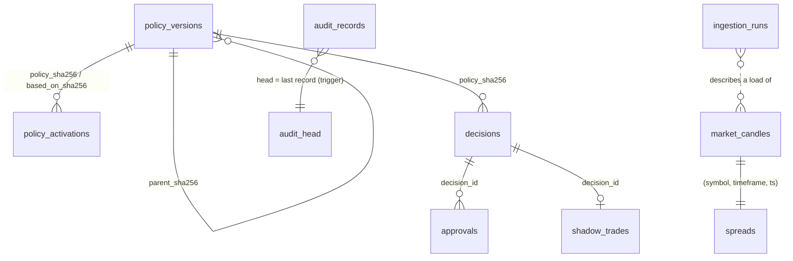

# 02 — Database Schema

PostgreSQL 16 (plain; TimescaleDB deferred by [ADR 0010](adr/0010-plain-postgresql-defer-timescaledb.md)).
Migrations are managed by Alembic in [`migrations/`](../migrations), and **the migrations are
the source of truth** for implemented tables. This document summarises them and keeps the
design DDL for tables planned in later milestones.

| Status | Tables |
|---|---|
| **Implemented (M2)** | `policy_versions`, `policy_activations`, `decisions`, `approvals`, `shadow_trades`, `audit_records`, `audit_head`, `market_candles`, `spreads`, `ingestion_runs` |
| Planned | everything in §1–§8 below, each marked with its milestone |

## Design principles
- **Append-only for anything auditable.** Triggers refuse UPDATE, DELETE and TRUNCATE on every
  append-only table, even for the owner. State changes are new rows.
- **Hash-chained audit log in its own table** (`audit_records`, ADR 0009). The chain head is
  anchored in `audit_head`, which only a trigger can advance. Decisions are not chained
  themselves; each decision is recorded in the audit chain.
- **Every decision references the exact policy hash** it was made under (foreign key), and an
  APPROVED decision must reference the policy active when it is recorded.
- **Money and prices as `NUMERIC`.** Never floats in persisted financial values.
- **All timestamps `TIMESTAMPTZ`;** every application session runs in UTC.
- **Role separation enforced by grants and ownership** (ADR 0011). No service role owns a table;
  the learning role cannot write policy in any way.

## 0. Implemented schema (M2)



| Table | Key | Writer role | Enforced by the database |
|---|---|---|---|
| `policy_versions` | `sha256` (content hash) | `human_admin` | immutable; `policy_id` unique; content re-hashed by the application on every load |
| `policy_activations` | `seq` | `human_admin` | linear history (each names the policy it replaces), first row `INITIAL`, recorded only once effective, non-tightening changes ≥ 24 h after approval |
| `decisions` | `decision_id` | `svc_risk` | APPROVED needs units > 0, candidate, state version, snapshot digest, no blocking rules, and the *currently active* policy hash; BLOCKED has zero units; full payload kept |
| `approvals` | `approval_id`, unique `(decision_id, authority)` | `svc_risk` | must belong to an APPROVED decision with identical bindings; `expires_at > issued_at` |
| `shadow_trades` | `decision_id` | `svc_risk` | outcome must equal its decision's outcome |
| `audit_records` | `seq`; unique `prev_hash`, `hash` | `svc_audit` | each insert must extend `audit_head` exactly; payload stored as the exact hashed canonical JSON text |
| `audit_head` | singleton | trigger only (`SECURITY DEFINER`) | never deleted or truncated; no role may update it directly |
| `market_candles` | `(symbol, timeframe, ts)` | `svc_market_data` | bid/ask OHLC consistent, prices positive, ask ≥ bid at open and close; BRIN index on `ts` |
| `spreads` | `(symbol, timeframe, ts)` → `market_candles` | `svc_market_data` | non-negative per-bar spreads at open and close |
| `ingestion_runs` | `run_id` | `svc_market_data` | status `SUCCEEDED`/`FAILED`; failure requires an error |

Migrations:

| Revision | Content |
|---|---|
| 0001 | roles (idempotent, cluster-wide), schema `sentinel` owned by `sentinel_owner`, default privileges, append-only guard function |
| 0002 | `policy_versions`, `policy_activations`, activation trigger, grants |
| 0003 | `decisions`, `approvals`, `shadow_trades`, binding triggers, grants |
| 0004 | `audit_records`, `audit_head`, head-advancing trigger, grants |
| 0005 | `market_candles`, `spreads`, `ingestion_runs`, grants |

The sections below are the **planned** schema for later milestones. They are unchanged from
the original design except where noted.

## 1. Reference data

```sql
CREATE EXTENSION IF NOT EXISTS timescaledb;
CREATE EXTENSION IF NOT EXISTS vector;
CREATE EXTENSION IF NOT EXISTS pgcrypto;

CREATE TYPE trade_side AS ENUM ('LONG','SHORT');
CREATE TYPE decision_outcome AS ENUM ('APPROVED','BLOCKED');
CREATE TYPE system_mode AS ENUM ('BACKTEST','SHADOW','PAPER','LIVE_MICRO','LIVE');
CREATE TYPE trading_state AS ENUM ('ACTIVE','NO_NEW_TRADES','FLATTEN','HALTED');

-- [MVP]
CREATE TABLE instruments (
  symbol          TEXT PRIMARY KEY,            -- 'EUR_USD'
  base_ccy        CHAR(3) NOT NULL,
  quote_ccy       CHAR(3) NOT NULL,
  pip_size        NUMERIC(10,8) NOT NULL,      -- 0.0001 / 0.01 for JPY
  min_units       NUMERIC NOT NULL,
  unit_step       NUMERIC NOT NULL,
  max_spread_pips NUMERIC NOT NULL,            -- absolute hard cap
  active          BOOLEAN NOT NULL DEFAULT true
);

CREATE TABLE trading_holidays (
  day DATE NOT NULL, market TEXT NOT NULL, kind TEXT NOT NULL,   -- 'closed' | 'thin'
  PRIMARY KEY (day, market)
);
```

## 2. Market data (remaining tables planned: M3/M7)

`market_candles` and `spreads` are implemented (see above). Planned:

```sql


-- [MVP] Agent 1 output
CREATE TABLE market_health_reports (
  id          UUID PRIMARY KEY DEFAULT gen_random_uuid(),
  symbol      TEXT NOT NULL REFERENCES instruments,
  as_of       TIMESTAMPTZ NOT NULL,
  regime      TEXT NOT NULL,                   -- low|normal|elevated|extreme
  trend_state JSONB NOT NULL,                  -- per timeframe: direction, ema alignment, adx
  structure   JSONB NOT NULL,                  -- swings, HH/HL state
  levels      JSONB NOT NULL,                  -- [{price, kind, touches, age_bars}]
  atr         JSONB NOT NULL,                  -- {H1:..., H4:..., D1:..., pctile:...}
  spread_ratio NUMERIC NOT NULL,
  liquidity_score NUMERIC NOT NULL,
  data_quality TEXT NOT NULL,                  -- OK|DEGRADED|STALE
  healthy     BOOLEAN NOT NULL,
  reasons     JSONB NOT NULL,
  code_version TEXT NOT NULL
);
CREATE INDEX ON market_health_reports (symbol, as_of DESC);

CREATE TABLE circuit_breaker_events (
  id UUID PRIMARY KEY DEFAULT gen_random_uuid(),
  ts TIMESTAMPTZ NOT NULL, symbol TEXT, trigger TEXT NOT NULL,   -- sigma_move|spread_blowout|tick_gap|multi_pair_jump
  observed NUMERIC, threshold NUMERIC, action trading_state NOT NULL,
  resolved_at TIMESTAMPTZ, resolved_by TEXT
);
```

## 3. Calendar, news and sessions

```sql
-- [MVP]
CREATE TABLE economic_events (
  id            UUID PRIMARY KEY DEFAULT gen_random_uuid(),
  source        TEXT NOT NULL,
  source_event_id TEXT NOT NULL,
  currency      CHAR(3) NOT NULL,
  title         TEXT NOT NULL,
  category      TEXT NOT NULL,                 -- CPI|NFP|RATE_DECISION|GDP|PMI|...
  tier          SMALLINT NOT NULL CHECK (tier IN (1,2,3)),
  scheduled_at  TIMESTAMPTZ NOT NULL,
  forecast TEXT, previous TEXT, actual TEXT,
  fetched_at    TIMESTAMPTZ NOT NULL,
  UNIQUE (source, source_event_id, fetched_at)
);
CREATE INDEX ON economic_events (scheduled_at);

CREATE TABLE risk_calendar_snapshots (         -- Agent 2 output
  id UUID PRIMARY KEY DEFAULT gen_random_uuid(),
  as_of TIMESTAMPTZ NOT NULL,
  blackout_windows JSONB NOT NULL,             -- [{currency,start,end,tier,event_ids,reason}]
  source_agreement BOOLEAN NOT NULL,
  feed_fresh BOOLEAN NOT NULL,
  discrepancies JSONB NOT NULL
);

-- [Phase 2]
CREATE TABLE news_items (
  id           UUID PRIMARY KEY DEFAULT gen_random_uuid(),
  source       TEXT NOT NULL,
  source_item_id TEXT NOT NULL,
  published_at TIMESTAMPTZ NOT NULL,
  received_at  TIMESTAMPTZ NOT NULL,
  headline     TEXT NOT NULL,
  body         TEXT,
  url          TEXT,
  embedding    vector(1024),                   -- dedup / novelty
  UNIQUE (source, source_item_id)
);
CREATE INDEX ON news_items USING hnsw (embedding vector_cosine_ops);

CREATE TABLE news_classifications (
  id UUID PRIMARY KEY DEFAULT gen_random_uuid(),
  news_item_id UUID NOT NULL REFERENCES news_items,
  classifier   TEXT NOT NULL,                  -- 'tripwire@1.0' | 'primary:<model>@prompt_v3' | 'secondary:<model>@prompt_v3'
  output       JSONB NOT NULL,                 -- validated NewsClassification
  severity     SMALLINT NOT NULL,
  latency_ms   INT, cost_usd NUMERIC(10,6),
  created_at   TIMESTAMPTZ NOT NULL DEFAULT now()
);

CREATE TABLE news_risk_snapshots (             -- Agent 3 output
  id UUID PRIMARY KEY DEFAULT gen_random_uuid(),
  as_of TIMESTAMPTZ NOT NULL,
  per_currency JSONB NOT NULL,                 -- {USD:{score, tripwires[], top_items[]}, ...}
  feed_fresh BOOLEAN NOT NULL
);

CREATE TABLE session_plans (                   -- Agent 4 output
  id UUID PRIMARY KEY DEFAULT gen_random_uuid(),
  trading_date DATE NOT NULL,
  as_of TIMESTAMPTZ NOT NULL,
  per_session JSONB NOT NULL,
  best_session TEXT, avoid_sessions TEXT[] NOT NULL,
  reasons JSONB NOT NULL
);
```

## 4. Governance (planned additions)

`policy_versions` and `policy_activations` are implemented (see above). Planned for M14: a `policy_change_requests` table so that approved-but-cooling-off loosening survives restarts (today an activation row is written only once it is effective). Planned with the state service (M8):

```sql


-- [MVP]
CREATE TABLE system_state_log (                -- append-only; current = latest row
  id BIGSERIAL PRIMARY KEY,
  ts TIMESTAMPTZ NOT NULL DEFAULT now(),
  mode system_mode NOT NULL,
  trading_state trading_state NOT NULL,
  reason TEXT NOT NULL,
  actor TEXT NOT NULL,                         -- 'human:<id>' | 'auto:<rule_id>'
  halt_requires_human BOOLEAN NOT NULL DEFAULT false
);
```

## 5. Decision runs (planned: M8)

`decisions` and `approvals` are implemented (see above). Rule results are stored inside `decisions.payload`. Planned with the LangGraph decision graph:

```sql
-- [MVP]
CREATE TABLE decision_runs (                   -- one LangGraph run per bar close
  id UUID PRIMARY KEY,
  trigger TEXT NOT NULL,                       -- 'bar_close:H1:2026-10-05T13:00Z'
  as_of TIMESTAMPTZ NOT NULL,
  mode system_mode NOT NULL,
  state_version BIGINT NOT NULL,               -- monotonic portfolio/account version read
  input_snapshot_ids JSONB NOT NULL,           -- {market:[...], calendar:..., news:..., session:..., portfolio:...}
  policy_sha256 CHAR(64) NOT NULL REFERENCES sentinel.policy_versions,
  code_version TEXT NOT NULL,                  -- git sha
  langgraph_thread_id TEXT NOT NULL,
  status TEXT NOT NULL,                        -- COMPLETED|FAILED_CLOSED
  errors JSONB NOT NULL DEFAULT '[]'
);

CREATE TABLE signal_candidates (
  id UUID PRIMARY KEY,
  run_id UUID NOT NULL REFERENCES decision_runs,
  symbol TEXT NOT NULL, side trade_side NOT NULL,
  detector TEXT NOT NULL,                      -- 'trend_pullback@1.2.0'
  entry_type TEXT NOT NULL,
  entry NUMERIC(18,8) NOT NULL, stop_loss NUMERIC(18,8) NOT NULL, take_profit NUMERIC(18,8) NOT NULL,
  rr_gross NUMERIC NOT NULL, rr_net NUMERIC NOT NULL,
  expires_at TIMESTAMPTZ NOT NULL,
  features JSONB NOT NULL                      -- decision-time feature vector for learning
);


```

## 6. Execution, positions and account

```sql
-- [MVP]
CREATE TABLE execution_intents (               -- outbox consumed by Execution Service
  id UUID PRIMARY KEY,                         -- also broker client_order_id
  decision_id UUID NOT NULL UNIQUE REFERENCES decisions,
  status TEXT NOT NULL,                        -- RECEIVED|VERIFYING|BLOCKED|SUBMITTING|SUBMITTED|FILLED|PARTIAL|REJECTED|EXPIRED|CLOSED
  status_history JSONB NOT NULL DEFAULT '[]',
  recheck_rule_results JSONB,
  created_at TIMESTAMPTZ NOT NULL DEFAULT now()
);

CREATE TABLE orders (
  id UUID PRIMARY KEY DEFAULT gen_random_uuid(),
  intent_id UUID NOT NULL REFERENCES execution_intents,
  broker_order_id TEXT,
  kind TEXT NOT NULL,                          -- ENTRY|SL|TP|CLOSE|MODIFY_SL
  symbol TEXT NOT NULL, side trade_side NOT NULL, units NUMERIC NOT NULL,
  price NUMERIC(18,8), status TEXT NOT NULL,
  request JSONB NOT NULL, response JSONB,
  ts TIMESTAMPTZ NOT NULL DEFAULT now()
);

CREATE TABLE fills (
  id UUID PRIMARY KEY DEFAULT gen_random_uuid(),
  order_id UUID NOT NULL REFERENCES orders,
  broker_fill_id TEXT UNIQUE,
  ts TIMESTAMPTZ NOT NULL, price NUMERIC(18,8) NOT NULL, units NUMERIC NOT NULL,
  commission NUMERIC NOT NULL DEFAULT 0, financing NUMERIC NOT NULL DEFAULT 0,
  slippage_pips NUMERIC
);

CREATE TABLE trades (                          -- one row per round-trip position
  id UUID PRIMARY KEY DEFAULT gen_random_uuid(),
  intent_id UUID NOT NULL UNIQUE REFERENCES execution_intents,
  symbol TEXT NOT NULL, side trade_side NOT NULL,
  opened_at TIMESTAMPTZ NOT NULL, closed_at TIMESTAMPTZ,
  entry_price NUMERIC(18,8) NOT NULL, exit_price NUMERIC(18,8),
  initial_stop NUMERIC(18,8) NOT NULL, units NUMERIC NOT NULL,
  risk_amount NUMERIC NOT NULL,                -- account ccy at entry
  pnl NUMERIC, r_multiple NUMERIC, mae_r NUMERIC, mfe_r NUMERIC,
  exit_reason TEXT                             -- SL|TP|TIME|BREAKEVEN|MANUAL|FLATTEN|WEEKEND|EVENT
);

CREATE TABLE account_snapshots (
  ts TIMESTAMPTZ NOT NULL, mode system_mode NOT NULL,
  balance NUMERIC NOT NULL, equity NUMERIC NOT NULL, margin_used NUMERIC NOT NULL,
  unrealized_pnl NUMERIC NOT NULL, peak_equity NUMERIC NOT NULL, drawdown_pct NUMERIC NOT NULL,
  state_version BIGINT NOT NULL,
  PRIMARY KEY (mode, ts)
);
SELECT create_hypertable('account_snapshots','ts');

CREATE TABLE portfolio_health_snapshots (     -- Agent 9 output
  id UUID PRIMARY KEY DEFAULT gen_random_uuid(),
  as_of TIMESTAMPTZ NOT NULL, state_version BIGINT NOT NULL,
  status TEXT NOT NULL,                        -- HEALTHY|CAUTION|CRITICAL
  currency_exposure JSONB NOT NULL,            -- {USD:{risk_pct:-0.8, notional:...}, ...}
  open_risk_pct NUMERIC NOT NULL, var_99_1d_pct NUMERIC, gap_risk_pct NUMERIC,
  corr_matrix JSONB, risk_of_ruin NUMERIC, reasons JSONB NOT NULL
);

CREATE TABLE reconciliation_runs (
  id BIGSERIAL PRIMARY KEY, ts TIMESTAMPTZ NOT NULL DEFAULT now(),
  matched BOOLEAN NOT NULL, discrepancies JSONB NOT NULL, action_taken TEXT
);
```

## 7. Learning (planned: M9–M12)

`shadow_trades` is implemented (see above). Simulated outcomes go into a separate append-only `shadow_trade_outcomes` table (M9), never into updates. Planned:

```sql

CREATE TABLE trade_journal (                   -- one per live/paper trade, enriched post-close
  trade_id UUID PRIMARY KEY REFERENCES trades,
  features JSONB NOT NULL,                     -- copied from candidate at decision time
  session TEXT NOT NULL, regime TEXT NOT NULL, news_score_max NUMERIC,
  process_grade TEXT,                          -- A: rules followed; B: deviation; C: system fault
  notes TEXT,
  embedding vector(1024)
);

CREATE TABLE lesson_reports (
  id UUID PRIMARY KEY DEFAULT gen_random_uuid(),
  period TEXT NOT NULL,                        -- 'weekly' | 'monthly'
  period_start DATE NOT NULL, period_end DATE NOT NULL,
  stats JSONB NOT NULL,                        -- computed by code; source of truth
  narrative TEXT,                              -- LLM; numbers validated against stats
  narrative_validation JSONB NOT NULL,
  created_at TIMESTAMPTZ NOT NULL DEFAULT now(),
  embedding vector(1024),
  UNIQUE (period, period_start)
);

CREATE TABLE learning_proposals (
  id UUID PRIMARY KEY DEFAULT gen_random_uuid(),
  created_at TIMESTAMPTZ NOT NULL DEFAULT now(),
  kind TEXT NOT NULL CHECK (kind IN ('STRATEGY_PARAM','FILTER','DETECTOR_DISABLE','RISK_RULE')),
  target TEXT NOT NULL,                        -- e.g. 'range_breakout@1.0.3' or 'R-SES-02'
  proposal JSONB NOT NULL,
  evidence JSONB NOT NULL,                     -- n, effect, CI, q-value, replay backtest id
  status TEXT NOT NULL DEFAULT 'OPEN' CHECK (status IN ('OPEN','ACCEPTED','REJECTED','EXPIRED')),
  reviewed_by TEXT, reviewed_at TIMESTAMPTZ,
  change_request_id UUID                -- policy_change_requests (M14); only via human action
);

CREATE TABLE backtest_runs (
  id UUID PRIMARY KEY DEFAULT gen_random_uuid(),
  config JSONB NOT NULL, code_version TEXT NOT NULL, data_range TSTZRANGE NOT NULL,
  is_oos BOOLEAN NOT NULL, n_variants_tested INT NOT NULL,
  metrics JSONB NOT NULL, created_at TIMESTAMPTZ NOT NULL DEFAULT now()
);
```

## 8. Operations

```sql
CREATE TABLE llm_calls (
  id UUID PRIMARY KEY DEFAULT gen_random_uuid(),
  ts TIMESTAMPTZ NOT NULL DEFAULT now(),
  purpose TEXT NOT NULL,                       -- NEWS_CLASSIFY|NEWS_XCHECK|EXPLAIN|LESSON
  provider TEXT NOT NULL, model TEXT NOT NULL, prompt_version TEXT NOT NULL,
  input_tokens INT, output_tokens INT, latency_ms INT, cost_usd NUMERIC(10,6),
  schema_valid BOOLEAN NOT NULL, retries SMALLINT NOT NULL DEFAULT 0, error TEXT
);

CREATE TABLE incidents (
  id UUID PRIMARY KEY DEFAULT gen_random_uuid(),
  opened_at TIMESTAMPTZ NOT NULL DEFAULT now(), closed_at TIMESTAMPTZ,
  severity TEXT NOT NULL, component TEXT NOT NULL, summary TEXT NOT NULL,
  trading_state_action trading_state, postmortem TEXT
);
```

## 9. Roles and grants

Implemented in migration 0001 and documented in [ADR 0011](adr/0011-database-security-model.md). The intended matrix lives in `src/sentinel/store/postgres/permissions.py`, and the `database` CI job compares it with the live database for every role × table × privilege. The earlier role list (`svc_perception`, `svc_decision`, `svc_api`, `human_risk_admin`) is superseded.

## 10. Retention
- Raw ticks are **not stored**; only per-minute spread summaries and M1 bars.
- `market_candles`, `spreads`: kept indefinitely, uncompressed (ADR 0010; revisit with tick data).
- Decisions, rule results, orders, fills and journal: retain indefinitely (audit).
- `llm_calls`: 1 year.
