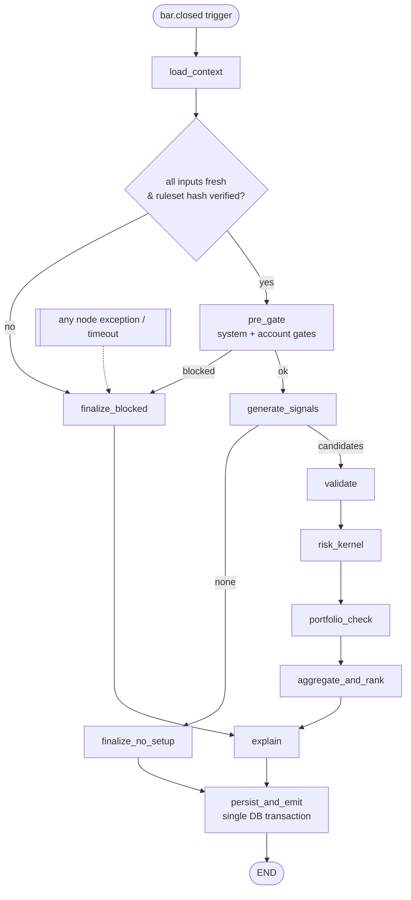
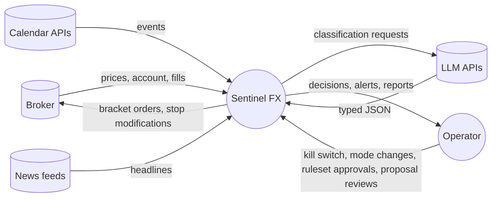
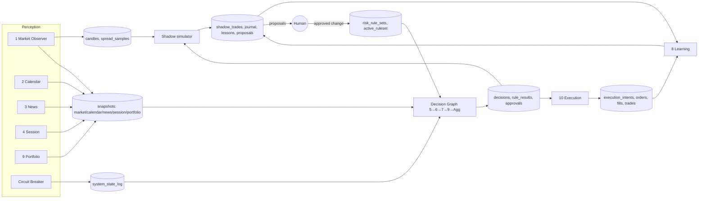
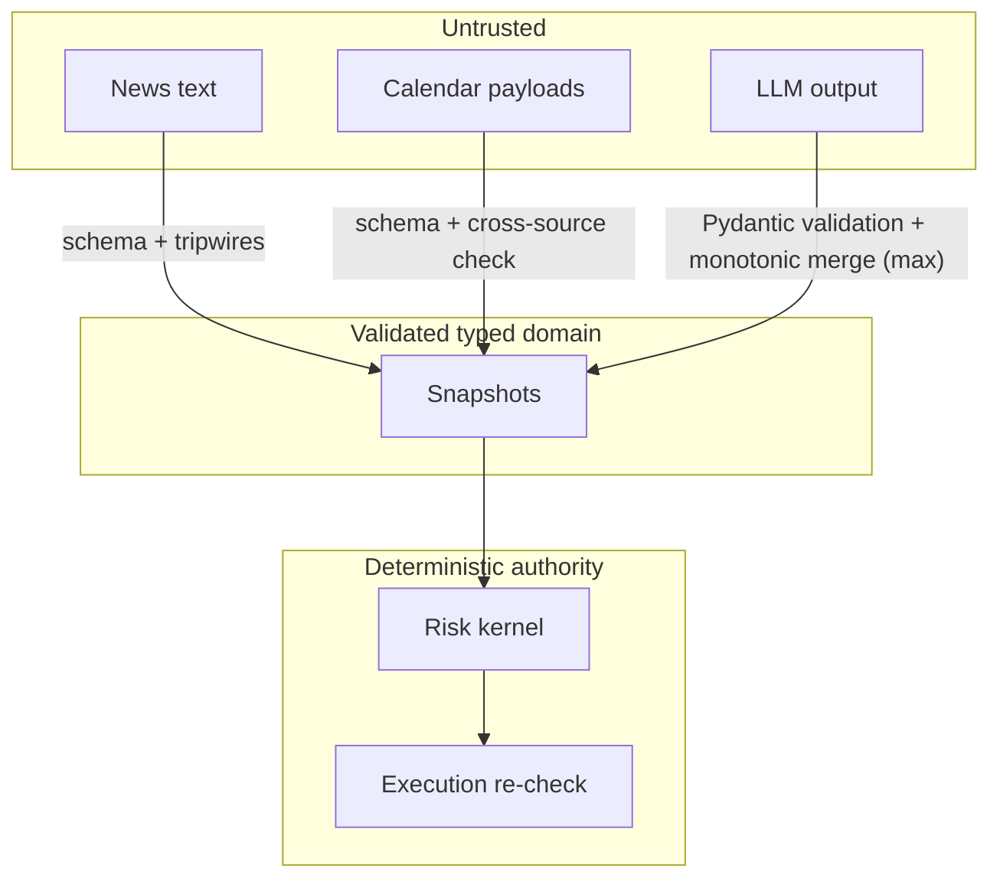

# 03 — Agent Communication, LangGraph Workflow, Data Flows

## 1. Agent communication flow

### 1.1 Rules of communication
1. **No free-text between agents.** Every message is a Pydantic model. Natural language exists only as the `rationale` or `explanation` fields that humans read. No component parses those fields.
2. **Two channels only:**
   - **Snapshots in Postgres.** Perception agents write timestamped, immutable rows. Consumers read "latest row where `as_of ≥ now − staleness_budget`". If there is no such row, the input is **missing**, and missing means **BLOCK**.
   - **Events on Redis Streams.** These are triggers only, never payload authority: `bar.closed.{tf}`, `intent.approved`, `alert.{severity}`, `state.changed`. Consumers always re-read authoritative state from Postgres.
3. **Authority is hierarchical, not negotiated.**

```
Human operator
   └── Kill Switch / Trading State  (can stop everything)
         └── Risk Kernel (Agent 7)  (veto over every trade; re-run at execution)
               ├── Portfolio Check (Agent 9)  (veto)
               └── Signal Validation (Agent 6)  (veto)
                     └── Signal Generation (Agent 5)  (proposes only)
Perception (Agents 1,2,3,4) — inform; can trigger HALTED via circuit breakers, feed failures, calendar disagreement; tripwires block the affected currency
Learning (Agent 8) — proposes to humans; zero runtime authority
Execution (Agent 10) — acts only with 3 fresh approvals + its own re-check
```

4. **Any agent can make the system more cautious. Only humans (via the approved ruleset) can make it less cautious.**

### 1.2 Sequence: one H1 bar close

```mermaid
sequenceDiagram
  autonumber
  participant MDS as Market Data Svc
  participant BUS as Redis Streams
  participant G as Decision Graph (LangGraph)
  participant DB as Postgres
  participant RK as Risk Kernel (lib)
  participant EX as Execution Svc
  participant BR as Broker

  MDS->>DB: write complete H1 candles (all 5 pairs)
  MDS->>BUS: bar.closed.H1 {ts}
  BUS->>G: trigger run(as_of = ts + 1s)
  G->>DB: read latest snapshots (market, calendar, news, session, portfolio, system_state, ruleset)
  G->>G: staleness check → missing ⇒ BLOCK run
  G->>G: pre-gate (kill switch, mode, circuit breakers, account limits)
  G->>G: generate candidates (Agent 5)
  loop each candidate
    G->>G: validate (Agent 6) → gates + score
    G->>RK: evaluate(candidate, portfolio_state, ruleset, market) 
    RK-->>G: RiskDecision + rule_results
    G->>G: portfolio check (Agent 9)
  end
  G->>G: aggregate: rank approved, cap to max_new_trades_per_run
  G->>DB: decisions, rule_results, approvals(TTL), shadow_trades, execution_intents (one txn)
  G->>BUS: intent.approved {intent_id}
  BUS->>EX: consume
  EX->>DB: advisory lock; load intent + approvals
  EX->>BR: fetch account/positions/price
  EX->>RK: re-evaluate with fresh state
  alt still APPROVED and drift ok
    EX->>BR: bracket order (entry+SL+TP, client_id=intent_id)
    BR-->>EX: fill / reject
    EX->>DB: orders, fills, trades
  else
    EX->>DB: intent BLOCKED + recheck rule_results
  end
```

### 1.3 Continuous (non-graph) flows
| Flow | Cadence | Can it change trading state? |
|---|---|---|
| Price stream → circuit breaker | per tick | Yes → `HALTED`. No auto-clear: resuming needs human review (automatic changes may only tighten) |
| Calendar refresh | 15 min (1 min within 2h of a tier-1 event) | Yes, on stale feed or source disagreement |
| News poll / stream | 30s–2 min per source | Yes, on a tripwire hit (currency-scoped) |
| Portfolio health | 60s | Yes, on `CRITICAL` or a loss-limit breach |
| Reconciliation | 60s, and at startup | Yes, on mismatch → `HALTED` + incident |
| Position manager | M5 close | No state change; manages stops per ruleset |
| Session plan | 21:30 UTC daily + hourly refresh | No |
| Learning jobs | nightly / weekly / monthly | **Never** |

## 2. LangGraph workflow

### 2.1 Graph



Notes:
- **Validation, risk and portfolio run on every candidate, even after one of them fails.** The reason is the explanation: the user sees every reason a trade is bad, not just the first. The verdict is still the logical AND.
- `load_context` reads the five snapshots in parallel (LangGraph `Send` fan-out, or one `asyncio.gather` inside the node).
- `persist_and_emit` is the **only** node with side effects. It writes everything in **one transaction**, using the outbox pattern for the event. A crash before commit therefore leaves no partial approvals.
- Checkpointer: `PostgresSaver` (thread_id = `run_id`). This gives a persisted trace of every node's input and output for audit and replay.
- **No LLM routes edges.** The only LLM call in the graph is inside `explain`, and only for optional prose after the canonical text is built. Its failure is ignored.

### 2.2 State

```python
# src/sentinel/decision/state.py
from typing import Annotated, TypedDict
import operator
from sentinel.domain import (MarketHealthReport, RiskCalendar, NewsRiskAssessment, SessionPlan,
    PortfolioHealth, SystemState, RuleSet, SignalCandidate, ValidationResult, RiskDecision,
    PortfolioCheck, FinalDecision, NodeError)

class DecisionState(TypedDict, total=False):
    run_id: str
    as_of: datetime                     # injected; nodes never call now()
    trigger: str
    state_version: int
    system: SystemState
    ruleset: RuleSet                    # verified sha256
    market: dict[str, MarketHealthReport]
    calendar: RiskCalendar
    news: NewsRiskAssessment
    session: SessionPlan
    portfolio: PortfolioHealth
    snapshot_ids: dict[str, list[str]]
    pre_gate: list[RuleResult]
    candidates: list[SignalCandidate]
    validations: dict[str, ValidationResult]
    risk: dict[str, RiskDecision]
    portfolio_checks: dict[str, PortfolioCheck]
    decisions: list[FinalDecision]
    errors: Annotated[list[NodeError], operator.add]
```

### 2.3 Fail-closed node wrapper

```python
def fail_closed(node_name: str, timeout_s: float):
    def deco(fn):
        @functools.wraps(fn)
        async def wrapped(state: DecisionState) -> dict:
            try:
                return await asyncio.wait_for(fn(state), timeout_s)
            except Exception as e:  # noqa: BLE001 — deliberately total
                log.exception("node_failed", node=node_name, run_id=state.get("run_id"))
                return {"errors": [NodeError(node=node_name, kind=type(e).__name__, msg=str(e)[:500])]}
        return wrapped
    return deco

def route_after(state: DecisionState, ok: str) -> str:
    return "finalize_blocked" if state.get("errors") else ok
```

### 2.4 Graph assembly

```python
def build_graph(deps: Deps) -> CompiledGraph:
    g = StateGraph(DecisionState)
    g.add_node("load_context",      fail_closed("load_context", 10)(deps.load_context))
    g.add_node("pre_gate",          fail_closed("pre_gate", 2)(deps.pre_gate))
    g.add_node("generate_signals",  fail_closed("generate_signals", 10)(deps.generate))
    g.add_node("validate",          fail_closed("validate", 5)(deps.validate))
    g.add_node("risk_kernel",       fail_closed("risk_kernel", 2)(deps.risk))
    g.add_node("portfolio_check",   fail_closed("portfolio_check", 5)(deps.portfolio))
    g.add_node("aggregate_and_rank",fail_closed("aggregate", 2)(deps.aggregate))
    g.add_node("finalize_blocked",  deps.finalize_blocked)       # cannot fail: pure, no I/O
    g.add_node("finalize_no_setup", deps.finalize_no_setup)
    g.add_node("explain",           deps.explain)                # LLM prose optional, swallowed
    g.add_node("persist_and_emit",  deps.persist_and_emit)       # on failure: run marked FAILED_CLOSED, nothing emitted

    g.add_edge(START, "load_context")
    g.add_conditional_edges("load_context", lambda s: route_after(s, "pre_gate")
                            if inputs_fresh(s) else "finalize_blocked")
    g.add_conditional_edges("pre_gate", lambda s: route_after(s, "generate_signals")
                            if all(r.passed for r in s["pre_gate"]) else "finalize_blocked")
    g.add_conditional_edges("generate_signals", lambda s: route_after(s,
                            "validate" if s["candidates"] else "finalize_no_setup"))
    for a, b in [("validate","risk_kernel"),("risk_kernel","portfolio_check"),
                 ("portfolio_check","aggregate_and_rank"),("aggregate_and_rank","explain")]:
        g.add_conditional_edges(a, lambda s, b=b: route_after(s, b))
    g.add_edge("finalize_blocked", "explain")
    g.add_edge("finalize_no_setup", "persist_and_emit")
    g.add_edge("explain", "persist_and_emit")
    g.add_edge("persist_and_emit", END)
    return g.compile(checkpointer=deps.checkpointer)
```

### 2.5 Aggregation rules (`aggregate_and_rank`)
- A candidate is `APPROVED` iff `validation.passed AND risk.outcome == APPROVED AND portfolio.approved`.
- At most **one new trade per run** and at most **one open position per pair**.
- If several are approved, the best calibrated score wins. Ties go to the lower-correlation pair versus the existing book.
- Portfolio checks for candidate *k* are recomputed **assuming candidates 1..k−1 were filled**. This prevents two approvals that are each fine alone but breach the USD exposure limit together.
- Every non-selected but approved candidate becomes `BLOCKED (stage=AGGREGATION, rule=R-AGG-01 max_new_trades_per_run)` and is shadow-tracked.

### 2.6 Replay
`sentinel replay --run-id <uuid>` loads `input_snapshot_ids`, the `ruleset_id` and the `code_version`, re-executes the graph with `as_of` fixed, and diffs the decisions. CI runs replay over a golden set of 50 historical runs. Any diff fails the build unless it is acknowledged in the PR.

## 3. Data flow diagrams

### 3.1 Level 0 — context



### 3.2 Level 1 — internal



### 3.3 Trust boundaries



LLM output crosses into the validated zone only through `max()`. It can raise a risk score and can never lower one.
