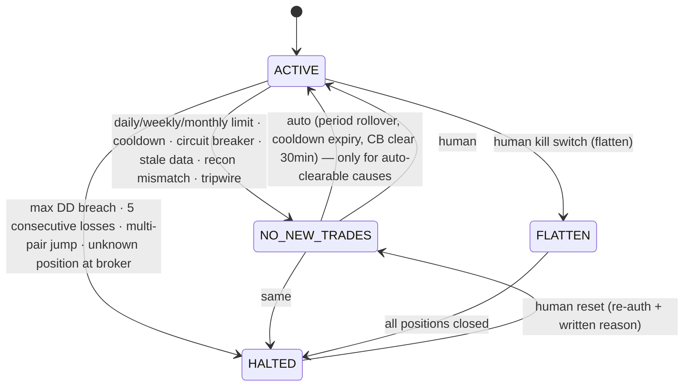

# 04 — Risk Engine Design (Agent 7: highest authority)

## 1. Contract

```python
def evaluate(
    candidate: SignalCandidate | None,      # None ⇒ evaluate account/system gates only
    account: AccountState,                  # equity, balance, peak, period P&L, open positions, state_version
    market: MarketContext,                  # prices, spreads, ATRs, blackout windows, circuit-breaker flags
    ruleset: RuleSet,                       # verified against active_ruleset.sha256
    as_of: datetime,
) -> RiskDecision:                          # outcome, approved_units, risk_pct, rule_results[], ruleset_sha256
```

**Properties (enforced by tests):**
- **Pure.** No I/O, no clock, no randomness, no global state. Same inputs give the same output, byte-for-byte.
- **Total.** It never raises. Malformed or missing input produces `BLOCKED` with `R-SYS-00 invalid_input`.
- **Exhaustive.** Every rule is evaluated and reported. The outcome is `APPROVED` iff every HARD rule passes.
- **Monotone in caution.** Making any input "worse" can never flip `BLOCKED` to `APPROVED`. Examples of worse: higher drawdown, higher spread, nearer event, more exposure. This is checked with property tests.
- **Small and boring.** Target under 800 lines, 100% branch coverage, `mypy --strict`, no dependencies beyond the standard library, `decimal` and pydantic.

It runs in two places, from the same library:
1. the decision graph (`risk_kernel` node);
2. the execution service, inside the lock, against **fresh broker state** (rule stage `EXECUTION_RECHECK`).

## 2. Ruleset (human-owned YAML → `risk_rule_sets`)

Default values are deliberately conservative. **The operator sets the final numbers.** They are listed here so the design is concrete.

```yaml
id: rs_v1
account_currency: USD
limits:
  risk_per_trade_pct: 0.50          # hard cap enforced in code at 1.00 regardless of YAML
  max_open_risk_pct: 1.50           # sum of open stop-risk
  max_open_positions: 3
  max_positions_per_pair: 1
  max_new_trades_per_day: 2
  max_effective_leverage: 5.0       # notional / equity
  max_margin_utilisation_pct: 20
loss_limits:                         # measured on equity (incl. unrealised) vs period-start equity
  daily_pct: 1.5                     # trading day = 17:00 New York → 17:00 New York
  weekly_pct: 3.0
  monthly_pct: 5.0
  max_drawdown_from_peak_pct: 10.0   # ⇒ HALTED, human reset required
drawdown_throttle:                   # automatic, tighten-only, pre-approved
  - {dd_pct: 4.0, risk_multiplier: 0.75}
  - {dd_pct: 6.0, risk_multiplier: 0.50}
  - {dd_pct: 8.0, risk_multiplier: 0.25}
streaks:
  cooldown_after_consecutive_losses: 3
  cooldown_hours: 24
  halt_after_consecutive_losses: 5   # ⇒ HALTED pending review
exposure:
  max_currency_net_risk_pct: 1.0     # per currency, signed sum (see §4)
  max_gap_loss_pct: 2.5              # worst-case gap scenario of whole book
  max_var99_1d_pct: 2.0
trade_quality:
  min_rr_net: 1.8
  min_stop_atr_h1: 1.0
  max_stop_atr_h1: 4.0
  min_stop_spread_multiple: 10
  max_entry_drift_atr: 0.25          # execution recheck
  signal_ttl_minutes: 15
market:
  max_spread_ratio: 1.5              # vs session median
  blackout:
    tier1_before_min: 60
    tier1_after_min: 60
    central_bank_before_min: 120
    central_bank_after_min: 30       # after press conference end
    tier2_before_min: 30
    tier2_after_min: 30
  rollover_no_trade: {start: "16:45", end: "17:30", tz: America/New_York}
  friday_no_new_entries_after_utc: "18:00"
  weekend_hold: require_stop_at_breakeven_or_close
  holiday_thin_liquidity: block_entries
  event_hold_policy: no_open_risk_in_affected_ccy_through_tier1_unless_stop_at_breakeven
data:
  max_price_age_s: 10
  max_market_report_age_s: 360
  max_calendar_age_s: 21600
  max_news_feed_silence_s: 900
  max_portfolio_snapshot_age_s: 120
execution:
  approval_ttl_s: 120
  require_broker_side_stop: true     # code-enforced; YAML cannot disable
```

**Code-level ceilings** cannot be overridden by YAML. A YAML file that exceeds them is rejected when it is loaded:
- risk per trade ≤ 1.0%
- daily loss ≤ 3%
- max drawdown ≤ 20%
- broker-side stop is always required
- leverage ≤ 10

## 3. Rule catalogue

Rules are grouped by tier. All are HARD unless marked otherwise.

| ID | Tier | Rule | Observed vs threshold |
|---|---|---|---|
| R-SYS-00 | System | Inputs well-formed and present | — |
| R-SYS-01 | System | Trading state == ACTIVE | state |
| R-SYS-02 | System | Mode permits orders (or SHADOW → simulated) | mode |
| R-SYS-03 | System | Ruleset sha256 == active_ruleset.sha256 | hashes |
| R-SYS-04 | System | All input snapshots within staleness budgets | ages |
| R-SYS-05 | System | Last reconciliation matched and is < 120s old | age, matched |
| R-SYS-06 | System | No active circuit breaker on pair or its currencies | flags |
| R-ACC-01 | Account | Daily loss < limit | −1.2% vs 1.5% |
| R-ACC-02 | Account | Weekly loss < limit | |
| R-ACC-03 | Account | Monthly loss < limit | |
| R-ACC-04 | Account | Not in consecutive-loss cooldown | |
| R-ACC-05 | Account | Drawdown from peak < halt level (breach ⇒ HALTED) | |
| R-ACC-06 | Account | New trades today < max | |
| R-MKT-01 | Market | Not within blackout for base or quote currency over [entry, entry + expected hold ∧ 4h] | |
| R-MKT-02 | Market | spread ≤ max_spread_ratio × session median and ≤ instrument absolute cap | |
| R-MKT-03 | Market | Not in rollover window | |
| R-MKT-04 | Market | Not after Friday cutoff; not a thin-liquidity holiday | |
| R-MKT-05 | Market | Volatility regime ≠ extreme | |
| R-MKT-06 | Market | No news tripwire active for either currency | |
| R-TRD-01 | Trade | Stop exists, on the correct side, distance in [min, max]×ATR(H1), ≥ 10× spread | |
| R-TRD-02 | Trade | rr_net ≥ min | |
| R-TRD-03 | Trade | Signal not expired | |
| R-TRD-04 | Trade | Computed units ≥ broker min after round-down | |
| R-TRD-05 | Trade | Margin after trade ≤ limit; effective leverage ≤ limit | |
| R-PTF-01 | Portfolio | Per-currency net risk after trade ≤ limit | |
| R-PTF-02 | Portfolio | Total open risk after trade ≤ limit | |
| R-PTF-03 | Portfolio | Open positions after trade ≤ max; ≤ 1 per pair | |
| R-PTF-04 | Portfolio | Gap-scenario loss after trade ≤ limit | |
| R-PTF-05 | Portfolio | 1-day VaR99 after trade ≤ limit | |
| R-EXE-01 | Exec recheck | Price drift ≤ max_entry_drift × ATR | |
| R-EXE-02 | Exec recheck | 3 approvals present, same state_version, unexpired, payload hash matches | |

## 4. Position sizing

```
effective_risk_pct = min(ruleset.risk_per_trade_pct, CODE_CAP_1PCT)
                     × drawdown_throttle(dd)               # ≤ 1
                     × mode_multiplier                      # LIVE_MICRO: 0.2
risk_amount_acct   = equity × effective_risk_pct / 100
stop_distance      = |entry − stop_loss| + expected_slippage + spread   # pessimistic
loss_per_unit_acct = stop_distance × fx(quote_ccy → account_ccy, at as_of)
units_raw          = risk_amount_acct / loss_per_unit_acct
units              = floor(units_raw / unit_step) × unit_step           # ALWAYS round down
if units < min_units: BLOCK R-TRD-04 (never round up)
```

Worked examples (USD account, equity 10,000, 0.5% risk = $50):
- **EURUSD long**, entry 1.0850, SL 1.0820 (30 pips) + 1.2 pips spread/slippage → 0.00312 USD/unit → **16,025 units**
- **USDJPY short**, entry 149.50, SL 150.10 (60 pips) + 1.5 → 0.615 JPY/unit ÷ 149.50 = 0.004114 USD/unit → **12,154 units**
- **USDCAD long**, quote is CAD, so the loss per unit is converted with the current USDCAD rate.

All arithmetic uses `Decimal`. Unit tests cover every pair against hand-computed values.

### Currency-exposure decomposition (why pair-correlation alone is not enough)
A position is split into its two currency legs. The **risk** contributed to each leg = the trade's stop-risk, signed:
- Long EURUSD (0.5% risk) → EUR +0.5, USD −0.5
- Long GBPUSD (0.5%) → GBP +0.5, USD −0.5
- **USD net risk = −1.0%. At the 1.0% limit, a third short-USD trade is blocked.**

EURUSD, GBPUSD and AUDUSD longs are effectively **one bet against USD**. This rule catches that without depending on a noisy correlation estimate. VaR, which uses an EWMA covariance, is a second, model-based check.

### Gap-scenario loss (R-PTF-04)
For each open position, assume the stop fills at `stop ± gap_k × ATR(D1)`:
- `gap_k = 0.5` normally;
- `1.5` when holding through a weekend or a tier-1 event;
- `3.0` for JPY/CHF crosses around intervention-risk flags.

The sum must stay ≤ `max_gap_loss_pct`. This is the explicit answer to "stops are not guarantees".

## 5. Trading-state machine



Every transition writes `system_state_log` with an actor and a reason, and raises an alert.

## 6. Risk of ruin (Agent 9 feeds it; the risk kernel consumes the result)

There is no reliable closed form when R-multiples vary, so it is estimated by **Monte Carlo**:
1. Sample R-multiples from the last *N* resolved trades, using live + paper + shadow-approved with the cost model. Use a **block bootstrap** (block = 5) to keep streakiness.
2. Pessimism adjustment: shift the sample so its mean equals the **lower 80% CI bound** of expectancy.
3. Simulate 20,000 paths of 100 trades at the current effective risk with the drawdown throttle applied.
4. `P(ruin) = P(drawdown ≥ halt level within 100 trades)`.

| P(ruin) | Action (pre-approved rule) |
|---|---|
| < 1% | normal |
| 1–5% | `CAUTION`; risk multiplier 0.5 |
| ≥ 5% | `CRITICAL` → `NO_NEW_TRADES`; alert human |
| N < 30 trades | use the backtest OOS distribution; **cap risk at 0.25%** until N ≥ 30 live/paper |

## 7. Governance of rule changes

```mermaid
flowchart LR
  A[Proposal: human or learning] --> B[Change request PENDING<br/>diff + direction TIGHTEN/LOOSEN]
  B --> C[Automatic replay backtest<br/>of last 12 months with proposed ruleset]
  C --> D{Human review<br/>re-auth + reason}
  D -- reject --> R[REJECTED]
  D -- approve TIGHTEN --> E[ACTIVE at next decision run]
  D -- approve LOOSEN --> F[effective_at = max(now+24h, next trading day)]
  F --> E
```

- The learning service's DB role cannot insert into `risk_rule_sets` or update `active_ruleset` (docs/02 §9).
- The risk kernel refuses to run if the in-memory ruleset hash ≠ `active_ruleset.sha256` (R-SYS-03).
- **No loosening while HALTED or in drawdown > 5%.** This is code-enforced. It stops anyone "fixing" a drawdown by raising limits, a classic failure of discretionary traders.

## 8. Testing requirements (gate for merging anything under `risk/`)
- **Property tests (hypothesis):**
  - `risk_amount(units) ≤ equity × cap` for all valid inputs.
  - Monotonic caution, per rule.
  - `evaluate` never raises.
  - Units are never above `units_raw`.
- **Table tests:** one passing and one failing case per rule ID; the reported observed and threshold values are asserted.
- **Golden decisions:** 50 canonical scenarios with snapshot-compared outputs.
- **Mutation testing** (`mutmut`) on `risk/` with ≥ 90% mutants killed.
