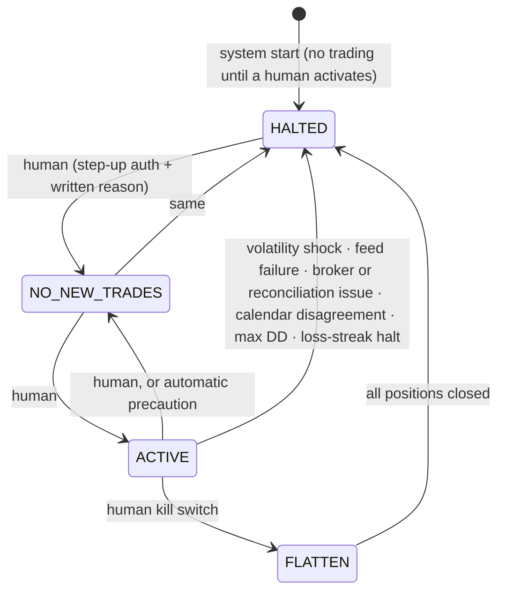

# 04 — Risk Engine Design (Agent 7: highest authority)

## 1. Contract

Implemented in `src/sentinel/risk/kernel.py` (M1).

```python
@dataclass(frozen=True)
class RiskInputs:                 # everything a rule may look at; nothing else is reachable
    decision_id: DecisionId
    as_of: datetime               # injected; the kernel never reads a clock
    candidate: SignalCandidate | None
    policy: RiskPolicy | None
    active_policy_sha256: str | None
    system: SystemState | None
    account: AccountSnapshot | None
    markets: Mapping[str, MarketSnapshot]
    calendar: CalendarSnapshot | None
    news: NewsRiskSnapshot | None
    instruments: Mapping[str, Instrument]
    holidays: frozenset[date]

def evaluate(inputs: RiskInputs) -> RiskDecision: ...
```

**Properties (enforced by tests):**
- **Pure.** No I/O, no clock, no randomness, no global state. The same inputs give an equal decision.
- **Total.** It never raises. Missing inputs fail `R-SYS-00` and every rule that needs them; a
  rule that raises fails itself; anything else yields a BLOCKED decision with `R-SYS-99`.
- **Exhaustive.** Every rule is evaluated and reported. The outcome is APPROVED only if every
  HARD rule passes and a valid size exists. `RiskDecision` refuses to construct anything else.
- **Monotone in caution.** Making an input worse never flips BLOCKED to APPROVED. Examples:
  higher loss, drawdown, spread, data age, news score, or trade count. Property-tested.
- **Standard library only** (plus `sentinel.domain` and `sentinel.fxmath`), `mypy --strict`.

It runs in two places, from the same code:
1. the decision path (`decision.risk_gate.RiskGate`, later the LangGraph `risk_kernel` node);
2. `risk.recheck.recheck_before_execution`, on fresh broker state, before any order (M10).

## 2. Policy (human-owned YAML → protected store)

The active policy is [`config/rulesets/rs_v1.yaml`](../config/rulesets/rs_v1.yaml), parsed by
`sentinel.config.policy_loader` into a frozen `RiskPolicy` (`sentinel.risk.policy`). The file
is not duplicated here, so the two cannot drift apart. Loading rejects:
- unknown keys and missing keys;
- floats (numbers are read as exact decimals);
- inconsistent values (e.g. daily > weekly loss, throttle multipliers > 1 or increasing);
- any value beyond a **code-level ceiling**. These are `CEILINGS` in `risk/policy.py`. The main ones:

| Field | Ceiling |
|---|---|
| risk per trade | ≤ 1.0 % (also capped again in sizing) |
| max open risk | ≤ 5 % |
| positions per pair | ≤ 1 (no pyramiding; revisit after M6–M8) |
| daily / weekly / monthly loss | ≤ 3 % / 6 % / 10 % |
| max drawdown | ≤ 20 % |
| effective leverage | ≤ 10× |
| min reward/risk net of costs | ≥ 1.0 |
| price / account / calendar freshness | ≤ 60 s / 300 s / 12 h |
| approval TTL | ≤ 10 min |
| broker-side stop | always required |

Loss limits are measured on **equity including unrealised P&L**, against **period-start
equity**, and include the new trade's risk. Example: the day starts at 10,000 with a
floating loss of 800, so equity is 9,200, an 8 % daily loss; new risk is judged against that.

## 3. Rule catalogue

All rules are HARD. Every decision reports every rule. This table is checked against the code
by `tests/unit/risk/test_rule_catalogue.py`: adding, removing or renumbering a rule without
updating this table fails the build.

| ID | Stage | Rule |
|---|---|---|
| R-SYS-00 | System | All required inputs present: candidate, policy, active policy hash, system state, account, calendar, news, and a market and instrument for every symbol in use |
| R-SYS-01 | System | Trading state is ACTIVE |
| R-SYS-02 | System | Policy hash equals the approved active policy hash |
| R-SYS-03 | System | Account snapshot fresh (age within [−clock skew, max]) |
| R-SYS-04 | System | Market data fresh for every symbol in use (snapshot age and last tick) |
| R-SYS-05 | System | Calendar fresh |
| R-SYS-06 | System | Calendar sources agree, and at least `min_calendar_sources` |
| R-SYS-07 | System | News risk fresh |
| R-SYS-08 | System | Broker reconciliation matched and recent |
| R-SYS-09 | System | No circuit breaker on any market sharing a currency with the trade |
| R-SYS-10 | System | Every open position has a broker-side stop |
| R-ACC-01 | Account | Daily loss including this trade's risk ≤ limit |
| R-ACC-02 | Account | Weekly loss including this trade's risk ≤ limit |
| R-ACC-03 | Account | Monthly loss including this trade's risk ≤ limit |
| R-ACC-04 | Account | Drawdown from peak < halt level |
| R-ACC-05 | Account | Not in the consecutive-loss cooldown |
| R-ACC-06 | Account | Consecutive losses below the halt count |
| R-ACC-07 | Account | Trades today below the daily maximum |
| R-MKT-01 | Market | No tier-1, tier-2 or central-bank blackout for either currency over [now, now + min(expected hold, max hold horizon)] |
| R-MKT-02 | Market | Spread ≤ ratio × session median and ≤ the instrument's absolute cap |
| R-MKT-03 | Market | Outside the rollover window (New York time, DST-aware) |
| R-MKT-04 | Market | Market open; before the Friday cutoff; not a holiday |
| R-MKT-05 | Market | Volatility regime is not EXTREME |
| R-MKT-06 | Market | Both currencies have a news assessment, no tripwire, score below limit |
| R-TRD-01 | Trade | Stop on the loss side; distance within [min, max] × ATR(H1) and ≥ k × spread |
| R-TRD-02 | Trade | Reward/risk net of spread and expected slippage ≥ minimum |
| R-TRD-03 | Trade | Signal not future-dated, not expired, TTL within policy |
| R-TRD-04 | Trade | A valid broker-precision size exists (rounded down; below minimum blocks) |
| R-TRD-05 | Trade | Gross effective leverage and margin after the trade within limits |
| R-PTF-01 | Portfolio | Each currency the trade touches ends within the net-risk limit, **or**, if already above it, strictly closer to zero (risk-reducing trades stay possible in a breached book) |
| R-PTF-02 | Portfolio | Total open stop-risk (gross) after the trade ≤ limit |
| R-PTF-03 | Portfolio | Open positions after the trade ≤ max; ≤ 1 per pair |
| R-PTF-04 | Portfolio | Gap-scenario loss (stops fill k × ATR(D1) beyond the level) ≤ limit |

Outside the kernel's per-decision rules:

| ID | Where | Rule |
|---|---|---|
| R-SYS-99 | kernel / fail-closed wrapper | Kernel or service failure, timeout, wrong result type, or audit/shadow write failure |
| R-APR-01 | `risk.approvals` | All required approvals present exactly once |
| R-APR-02 | `risk.approvals` | Approvals belong to this decision |
| R-APR-03 | `risk.approvals` | Bound to the current account state version and the decision's snapshot digest |
| R-APR-04 | `risk.approvals` | Payload (candidate, size, policy hash) unchanged |
| R-APR-05 | `risk.approvals` | Within the validity window [issued, expires) |
| R-EXE-01 | `risk.recheck` | Price drift from the signal entry ≤ k × ATR(H1) |
| R-EXE-02 | `risk.recheck` | The original decision approved this candidate |
| R-EXE-03 | `risk.recheck` | Policy unchanged since approval |

**Deferred:** a 1-day VaR99 limit (formerly R-PTF-05) needs the covariance model from M11.

**Gross versus net.** R-PTF-01 measures *net* exposure per currency. R-PTF-02 (total stop-risk),
R-PTF-04 (gap loss) and R-TRD-05 (leverage and margin) are *gross* measures, and a hedge adds
to all of them. Under rs_v1 (1.0 % net per currency, 1.5 % total, 0.5 % per trade), a book
that is over a currency limit is necessarily over 1.0 % total open risk, so a new hedge also
fails R-PTF-02. Whether a hedge in a breached book may pass the gross limits is an open
policy decision.

## 4. Position sizing

```
effective_risk_pct = min(ruleset.risk_per_trade_pct, CODE_CAP_1PCT)
                     × drawdown_throttle(dd)               # ≤ 1
                     × mode_multiplier                      # LIVE_MICRO: 0.2
risk_amount_acct   = equity × effective_risk_pct / 100
stop_distance      = |entry − stop_loss| + expected_slippage + spread   # pessimistic
loss_per_unit_acct = stop_distance × fx(quote_ccy → account_ccy, at as_of)
units_raw          = risk_amount_acct / loss_per_unit_acct
units              = floor(units_raw / unit_step) × unit_step           # ALWAYS round down
if units < min_units: BLOCK R-TRD-04 (never round up)
```

**Limit checks use the maximum size, not this one (ADR 0013).** The loss-limit, exposure,
total-risk, gap and leverage rules judge the trade at `equity × min(risk_per_trade, cap)`,
before the throttle, the mode multiplier, costs and rounding. A size reduction therefore never
lets a trade slip under a limit it would otherwise breach. The size above is what is approved.

Worked examples (USD account, equity 10,000, 0.5% risk = $50):
- **EURUSD long**, entry 1.0850, SL 1.0820 (30 pips) + 1.2 pips spread/slippage → 0.00312 USD/unit → **16,025 units**
- **USDJPY short**, entry 149.50, SL 150.10 (60 pips) + 1.5 → 0.615 JPY/unit ÷ 149.50 = 0.004114 USD/unit → **12,154 units**
- **USDCAD long**, quote is CAD, so the loss per unit is converted with the current USDCAD rate.

All arithmetic uses `Decimal`. Unit tests cover every pair against hand-computed values.

### Currency-exposure decomposition (why pair-correlation alone is not enough)
A position is split into its two currency legs. The **risk** contributed to each leg = the trade's stop-risk, signed:
- Long EURUSD (0.5% risk) → EUR +0.5, USD −0.5
- Long GBPUSD (0.5%) → GBP +0.5, USD −0.5
- **USD net risk = −1.0%. At the 1.0% limit, a third short-USD trade is blocked.**

EURUSD, GBPUSD and AUDUSD longs are effectively **one bet against USD**. This rule catches that without depending on a noisy correlation estimate. VaR, which uses an EWMA covariance, is a second, model-based check.

### Gap-scenario loss (R-PTF-04)
For each open position, assume the stop fills at `stop ± gap_k × ATR(D1)`:
- `gap_k = 0.5` normally;
- `1.5` when holding through a weekend or a tier-1 event;
- `3.0` for JPY/CHF crosses around intervention-risk flags.

The sum must stay ≤ `max_gap_loss_pct`. This is the explicit answer to "stops are not guarantees".

## 5. Trading-state machine



Rules (implemented in `risk/state_machine.py`, tested in `tests/safety`):
- **Automatic actors only tighten.** No automatic transition ever moves towards ACTIVE.
  There is **no auto-clear**: after a volatility shock, feed failure, broker issue or calendar
  disagreement the system stays HALTED until a human has reviewed it.
- **Humans loosen one step at a time:** HALTED → NO_NEW_TRADES → ACTIVE. FLATTEN can only
  end in HALTED.
- Period loss limits, cooldowns and streak limits are **not** sticky states. The kernel
  evaluates them on every decision (R-ACC-*), so they block for exactly as long as they apply.
- Every transition, and every refused transition, is written to the audit chain *before*
  the state changes. If the audit write fails, the state does not change.

## 6. Risk of ruin (Agent 9 feeds it; the risk kernel consumes the result)

There is no reliable closed form when R-multiples vary, so it is estimated by **Monte Carlo**:
1. Sample R-multiples from the last *N* resolved trades, using live + paper + shadow-approved with the cost model. Use a **block bootstrap** (block = 5) to keep streakiness.
2. Pessimism adjustment: shift the sample so its mean equals the **lower 80% CI bound** of expectancy.
3. Simulate 20,000 paths of 100 trades at the current effective risk with the drawdown throttle applied.
4. `P(ruin) = P(drawdown ≥ halt level within 100 trades)`.

| P(ruin) | Action (pre-approved rule) |
|---|---|
| < 1% | normal |
| 1–5% | `CAUTION`; risk multiplier 0.5 |
| ≥ 5% | `CRITICAL` → `NO_NEW_TRADES`; alert human |
| N < 30 trades | use the backtest OOS distribution; **cap risk at 0.25%** until N ≥ 30 live/paper |

## 7. Governance of rule changes

```mermaid
flowchart LR
  A[Proposal: human or learning] --> B[Change request PENDING<br/>diff + direction TIGHTEN/LOOSEN]
  B --> C[Automatic replay backtest<br/>of last 12 months with proposed ruleset]
  C --> D{Human review<br/>re-auth + reason}
  D -- reject --> R[REJECTED]
  D -- approve TIGHTEN --> E[ACTIVE at next decision run]
  D -- approve LOOSEN --> F[effective_at = max(now+24h, next trading day)]
  F --> E
```

- The learning service's DB role cannot insert into `risk_rule_sets` or update `active_ruleset` (docs/02 §9).
- The risk kernel refuses to run if the in-memory ruleset hash ≠ `active_ruleset.sha256` (R-SYS-03).
- **No loosening while HALTED or in drawdown > 5%.** This is code-enforced. It stops anyone "fixing" a drawdown by raising limits, a classic failure of discretionary traders.

## 8. Testing requirements (gate for merging anything under `risk/`)
- **Property tests (hypothesis):**
  - `risk_amount(units) ≤ equity × cap` for all valid inputs.
  - Monotonic caution, per rule.
  - `evaluate` never raises.
  - Units are never above `units_raw`.
- **Table tests:** one passing and one failing case per rule ID; the reported observed and threshold values are asserted.
- **Golden decisions:** 50 canonical scenarios with snapshot-compared outputs.
- **Mutation testing** (`mutmut`) on `risk/` with ≥ 90% mutants killed.
