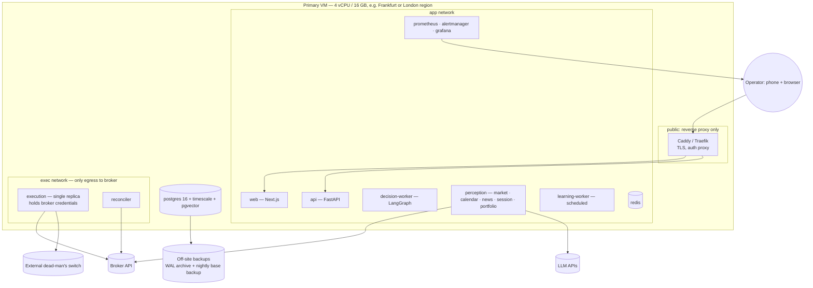

# 07 — Deployment Architecture and API Design

## 1. Deployment architecture

### 1.1 Topology
At H1 frequency latency is irrelevant, so **reliability and isolation** drive the design, not co-location.



**Isolation rules:**
- Only `execution` and `reconciler` hold **trading** credentials. `perception` uses a separate **read-only** broker token if the broker supports one; otherwise it reads prices through an internal price service owned by the execution network.
- The LLM-calling containers have no route to the broker order endpoints and no trading secrets.
- Postgres is not exposed publicly. Each service connects with its own role (docs/02 §9).
- The `execution` container runs `replicas: 1` **and** takes a Postgres advisory lock at startup. A second instance refuses to start, so there is never a double writer.

### 1.2 Compose services

| Service | Image | Restart | Health check |
|---|---|---|---|
| postgres | timescale/timescaledb-ha (pg16, includes pgvector) | always | `pg_isready` |
| redis | redis:7 (AOF on) | always | `PING` |
| perception | `sentinel:<sha>` cmd `sentinel perception` | always | heartbeat age < 60s |
| decision-worker | `sentinel:<sha>` cmd `sentinel decide` | always | last run age < 70 min (market hours) |
| execution | `sentinel:<sha>` cmd `sentinel execute` | always | reconciled < 120s |
| learning-worker | `sentinel:<sha>` cmd `sentinel learn --schedule` | unless-stopped | job status |
| api | `sentinel:<sha>` cmd `uvicorn sentinel.api:app` | always | `/healthz` |
| web | `sentinel-web:<sha>` | always | `/` |
| prometheus, alertmanager, grafana | upstream | always | built-in |

One Python image, many entrypoints. The decision, execution and backtest code is therefore guaranteed to be the same build.

### 1.3 Startup sequence (execution service)
1. Acquire the advisory lock, or exit.
2. Load the active ruleset and verify its hash.
3. **Reconcile:** fetch broker positions and orders; compare with DB.
   - Unknown broker position → attach a stop if it has none (ATR-based emergency stop), set `HALTED`, P1 alert.
   - DB position missing at the broker → mark it closed with exit reason `UNKNOWN`, then incident.
4. Verify every open position has a broker-side stop. If not, place one or flatten.
5. Only then start consuming intents. Intents older than their TTL are marked `EXPIRED`.

### 1.4 Secrets and config
- Secrets in **Docker secrets** or SOPS-encrypted files (age keys). They are never in the image, env files in git, logs or LLM prompts.
- Broker API token scope: practice and live tokens are separate secrets. The `LIVE` mode refuses to start with a practice token, and vice versa.
- The risk ruleset lives as YAML in the repo for review. It only becomes **active** through the DB approval flow, not by deploy.

### 1.5 CI/CD
- GitHub Actions runs on each PR:
  - lint (ruff), `mypy --strict` on core packages
  - unit + property tests, fail-closed fuzz suite, golden replay
  - build image, run Trivy scan
- Deploy is a **manual, tagged** release. `docker compose pull && up -d` happens only when `trading_state ∈ {NO_NEW_TRADES, HALTED}` or outside market hours. The deploy script sets `NO_NEW_TRADES`, waits for in-flight intents, deploys, runs the startup reconciliation, and asks the operator to resume.
- Rollback: previous image tag plus Alembic downgrade. Migrations must be backward-compatible for one release.

### 1.6 Backups and DR
- Continuous WAL archiving to off-site object storage, a nightly base backup, and a **monthly restore drill** to a scratch VM (tested restore or it doesn't count).
- RPO ≤ 5 min. RTO ≤ 1 hour. During an outage, broker-side stops protect open positions and the dead-man's switch pages the operator.
- Cold standby: the documented `bootstrap.sh` recreates the stack on a fresh VM from images and the latest backup.

### 1.7 Cost envelope (indicative)
VM €30–60/mo; licensed calendar/news APIs vary widely (check current pricing); LLM: news classification at ~2–5k headlines/day on a small model plus weekly narration, typically tens of USD/month. Cap it with a hard budget in config. The **broker practice account is free**.

## 2. API design (FastAPI, `/api/v1`)

**Auth:** single operator, OIDC (or passkeys) via the reverse proxy + session JWT. Dangerous endpoints (🔐) require **step-up re-authentication** (WebAuthn assertion within the last 5 min) and a written `reason`. All mutations are written to an audit table.

### 2.1 Read endpoints

| Method | Path | Returns |
|---|---|---|
| GET | `/healthz`, `/readyz` | liveness / readiness |
| GET | `/system/state` | mode, trading_state, reason, since, active ruleset id + sha |
| GET | `/market/health?pair=` | latest `MarketHealthReport`s |
| GET | `/calendar/risk?from=&to=` | events + blackout windows |
| GET | `/news/risk` | per-currency score, tripwires, top items |
| GET | `/sessions/plan?date=` | `SessionPlan` (best / avoid) |
| GET | `/portfolio/health` | equity, DD, exposure, VaR, risk of ruin |
| GET | `/portfolio/equity-curve?from=&to=&mode=` | series |
| GET | `/decisions?from=&outcome=&pair=&rule_id=&cursor=` | paginated decisions |
| GET | `/decisions/{id}` | decision + all rule_results + snapshot refs + canonical/prose explanation |
| GET | `/decisions/{id}/replay` | re-executes and returns diff (async job) |
| GET | `/trades?status=&cursor=`, `/trades/{id}` | trades with journal |
| GET | `/shadow-trades?rule_id=&cursor=` | counterfactuals |
| GET | `/learning/lessons?period=`, `/learning/lessons/{id}` | reports |
| GET | `/learning/proposals?status=` | proposals with evidence |
| GET | `/risk/rulesets`, `/risk/rulesets/{id}`, `/risk/change-requests` | governance history |
| GET | `/evaluation/promotion-check?to=PAPER` | evidence vs gate, pass/fail per criterion |

### 2.2 Mutating endpoints

| Method | Path | Body | Notes |
|---|---|---|---|
| POST 🔐 | `/system/kill-switch` | `{action: "NO_NEW_TRADES" \| "FLATTEN", reason}` | Always allowed; **no step-up required for tightening actions**, so the operator can stop things fast from a phone |
| POST 🔐 | `/system/resume` | `{reason}` | HALTED → NO_NEW_TRADES, or NO_NEW_TRADES → ACTIVE; requires step-up |
| POST 🔐 | `/system/mode` | `{to, reason}` | Promotion gated by `/evaluation/promotion-check`; demotion always allowed |
| POST | `/risk/change-requests` | `{base_ruleset_id, yaml, reason}` | Creates PENDING + triggers replay backtest |
| POST 🔐 | `/risk/change-requests/{id}/approve` | `{reason}` | Uses the `human_admin` DB role; applies cooling-off for LOOSEN |
| POST | `/risk/change-requests/{id}/reject` | `{reason}` | |
| POST | `/learning/proposals/{id}/review` | `{decision: ACCEPT\|REJECT, reason}` | ACCEPT on `RISK_RULE` opens a change request; it does not apply anything |
| POST | `/trades/{id}/journal` | `{notes, process_grade}` | operator annotations |
| POST | `/backtests` | config | async job → `backtest_runs` |

**There is intentionally no endpoint to place, modify or close an individual trade**, apart from the global FLATTEN. Discretionary overrides are the main way systematic risk controls get bypassed. If the operator wants to trade manually, they use the broker's platform, and reconciliation will then flag the unknown position and halt the system. That is the intended behaviour.

### 2.3 Streaming
`GET /ws` (WebSocket) pushes `state.changed`, `decision.created`, `trade.updated`, `alert.raised` and `portfolio.tick` (1/min).

### 2.4 Example response — `GET /decisions/{id}`
```json
{
  "id": "d_8f21…", "run_id": "r_…", "as_of": "2026-10-05T12:00:01Z",
  "outcome": "BLOCKED", "stage_blocked": "RISK",
  "candidate": {"pair": "EUR_USD", "side": "LONG", "detector": "trend_pullback@1.2.0",
                "entry": "1.08500", "stop_loss": "1.08200", "take_profit": "1.09130", "rr_net": "2.10"},
  "ruleset": {"id": "rs_v7", "sha256": "4be1…"},
  "rule_results": [
    {"stage": "RISK", "rule_id": "R-MKT-01", "passed": false, "severity": "HARD",
     "observed": {"event": "USD CPI", "at": "2026-10-05T12:30:00Z", "minutes_until": 29},
     "threshold": {"tier1_before_min": 60}, "message": "Tier-1 blackout for USD"}
  ],
  "explanation": {"canonical": "TRADE BLOCKED — …", "prose": "…"},
  "snapshots": {"market": ["…"], "calendar": "…", "news": "…", "session": "…", "portfolio": "…"},
  "hash": "…", "prev_hash": "…"
}
```
